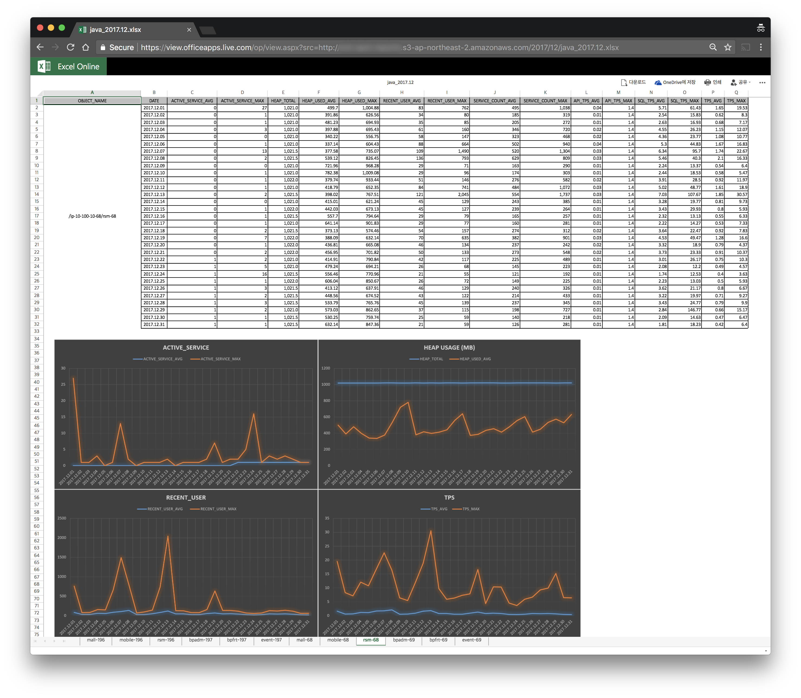

# scouter-plugin-server-reporting
### Scouter 수집 데이터를 이용한 일별, 월별 통계 레포팅을 위한 빌트인 서버 플러그인

- 본 프로젝트는 스카우터 서버 플러그인으로써 서버가 수집한 각종 데이터를 기반으로 Excel 형식의 일, 월별 통계 레포팅 파일을 작성하는 역할을 한다. 
- 현재 지원되는 통계 데이터의 종류는 다음과 같다.
    - 일, 월별 Alert 히스토리
    - 일, 월별 호스트 에이전트에 대한 CPU, Memory, Network, Disk 통계 정보
    - 일, 월별 자바 에이전트에 대한 Active Service, Heap, Recent User, Service Count, API TPS, SQL TPS, TPS 통계 정보
    - 일, 월별 각 애플리케이션 별 서비스에 대한 Elapsed Time, SQL Count, SQL Time, Request Count, Error Count, Elapsed Exceed Count 통계 정보
    - 월별 애플리케이션 운영 현황 (호출 빈도 Top 10 서비스, Worst 서비스)
- Samples
    - <a href="./documnet/sample/daily/alert_2017.12.31.xlsx">alert_2017.12.31.xlsx</a>, <a href="./documnet/sample/monthly/alert_2017.12.xlsx">alert_2017.12.xlsx</a>
    - <a href="./documnet/sample/daily/host_2017.12.31.xlsx">host_2017.12.31.xlsx</a>, <a href="./documnet/sample/monthly/host_2017.12.xlsx">host_2017.12.xlsx</a>
    - <a href="./documnet/sample/daily/java_2017.12.31.xlsx">java_2017.12.31.xlsx</a>, <a href="./documnet/sample/monthly/java_2017.12.xlsx">java_2017.12.xlsx</a>
    - <a href="./documnet/sample/daily/service_2017.12.31.xlsx">service_2017.12.31.xlsx</a>, <a href="./documnet/sample/monthly/service_2017.12.xlsx">service_2017.12.xlsx</a>
    - <a href="./documnet/sample/daily/operation_2017.12.xlsx">operation_2017.12.xlsx</a>

### Properties (스카우터 서버 설치 경로 하위의 conf/scouter.conf)
* **_ext\_plugin\_reporting\_logging\_enabled_** : 로깅 여부 - 기본 값은 false
* **_ext\_plugin\_reporting\_drop\_table_** : Derby DB 초기화 여부 - 기본 값은 false
* **_ext\_plugin\_reporting\_max\_elapsed\_time_** : 서비스에 대한 허용 가능한 응답시간(ms) - 기본 값은 5000
* **_ext\_plugin\_reporting\_output\_dir_** : 레포팅 파일 저장 경로 - 기본 값은 {user.home}/scouter 
* **_ext\_plugin\_reporting\_application\_name_** : 운영 현황 레포트에 포함될 애플리케이션 명

* Example
```
# Reporting
ext_plugin_reporting_drop_table=false
ext_plugin_reporting_logging_enabled=false
ext_plugin_reporting_max_elapsed_time=5000
ext_plugin_reporting_output_dir=/opt/apm/scouter/reporting
ext_plugin_reporting_application_name=osc-portal
```  

### Dependencies
* Project
    - scouter.common
    - scouter.server
* Library
    - commons-codec-1.10.jar
    - commons-io-2.5.jar
    - curvesapi-1.03.jar
    - derby-10.12.1.1.jar
    - derbyclient-10.12.1.1.jar
    - derbynet-10.12.1.1.jar
    - derbytools-10.12.1.1.jar
    - mybatis-3.4.0.jar
    - poi-3.14.jar
    - poi-ooxml-3.14.jar
    - poi-ooxml-schemas-3.14.jar
    - stax-api-1.0.1.jar
    - xmlbeans-2.6.0.jar
    
### Build & Deploy
* Build
    - mvn clean package
    
* Deploy
    - 디펜던시 라이브러리와 함께 scouter-plugin-server-reporting-x.x.x.jar 파일을 복사하여 스카우터 서버 설치 경로 하위의 lib/ 폴더에 저장한다.
    
## Appendix
##### 필수 사항 #####
* 자바 에이전트의 obj_name은 반드시 설정해야 하며, 이중화 환경에서 오브젝트 명을 기준으로 그룹핑하여 서비스 통계정보를 레포팅 하기 위해 scouter-01, scouter-02와 같이 이름에 '-' 가 포함되어야 한다.

##### 일/월별 수동 레포팅 파일 생성 #####
* java -cp .:/opt/apm/scouter/server/lib/* scouter.plugin.server.reporting.ReportingPlugin {yyyymmdd or yyyymm}

##### DB Schema #####
>

##### DB 저장 경로 변경 #####
* 1. Symbolic Link를 사용한다.
* 2. Scouter Server 설치 디렉토리에 config.properties 파일을 생성하고 다음과 같이 작성한다.
  - url=jdbc:derby:/opt/apm/scouter/server/scouterDB;create=true
    - /opt/apm/scouter/server/scouterDB 를 원하는 경로로 변경한다.

##### DB 데이터 저장 주기 #####
* 통계 데이터 저장을 위한 일별 테이블은 2개월간 데이터가 유지되며, 저장 기간에 대한 옵션은 없다.

##### 브라우저를 이용한 통계 레포팅 파일 조회 #####
* Web Server를 사용하거나 AWS S3 버킷에 레포팅 파일을 저장할 경우 브라우저를 이용하여 레포팅 파일을 조회할 수 있다.
>
>
>
> 